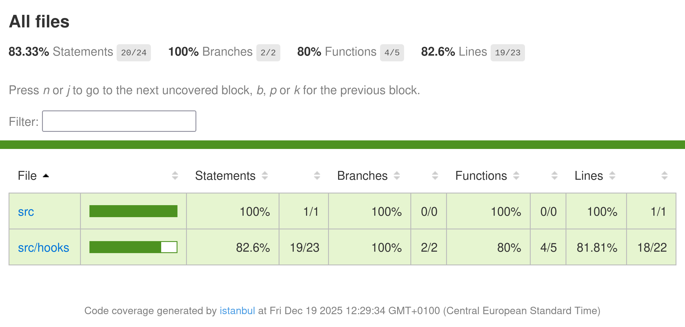

# Project farmers market

[Github repo - Farmers market](https://github.com/Caprpar/Farmers-Market/)

TDD test implementation commit hash
feabaaf7fc653da89103658d6355cf9dc102c62d

Code coverage


```bash
$ nyc report --reporter=text-summary --reporter=html
=============================== Coverage summary ===============================
Statements   : 83.33% ( 20/24 )
Branches     : 100% ( 2/2 )
Functions    : 80% ( 4/5 )
Lines        : 82.6% ( 19/23 )
================================================================================
```
